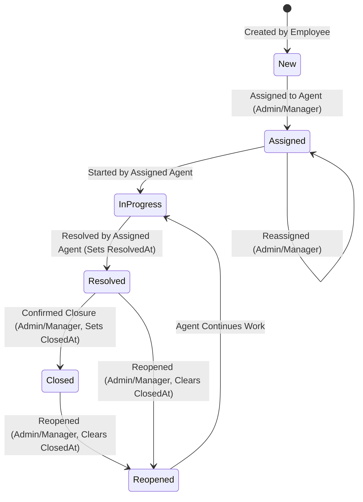
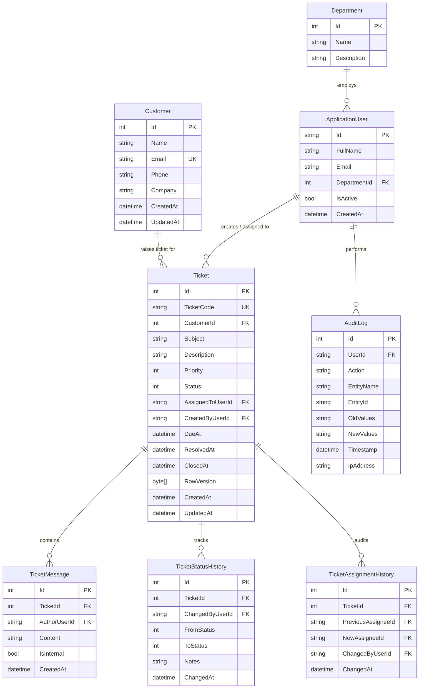

# OpsDesk — Internal Customer Support & Operations Management System

> A portfolio implementation of an internal support and operations system, built with **.NET 9**, **ASP.NET Core MVC**, **Entity Framework Core 9**, **SQL Server**, **ASP.NET Core Identity**, and **Bootstrap 5**.

[](https://dotnet.microsoft.com/)
[](https://learn.microsoft.com/ef/core/)
[](LICENSE)

---

## 1. Product & Architecture Overview

**OpsDesk** is an internal web platform designed for support representatives, operations managers, and system administrators to manage customer relationships and resolve technical support requests. It is intentionally engineered as an **internal-only system** — external clients never log into this portal.

### Engineering Philosophy: "What Problem Does This Solve?"
This system adheres strictly to pragmatic enterprise design principles:
- **No unnecessary microservices or distributed message brokers**: Avoids premature distributed complexity (Kafka/RabbitMQ/Kubernetes) when a modular monolith with atomic transactions fully addresses the business domain.
- **Repository Pattern with Unit of Work (UOW)**: Decouples domain logic from persistence mechanisms, maintains strict transaction boundaries, and enforces **short-lived transactions**.
- **Dual Authentication**: Hybrid architecture featuring secure **Cookie Authentication** for MVC server-rendered views (with CSRF and HttpOnly protections) and **JWT Bearer Authentication** with rich claims for API clients.
- **Dynamic Policy-Based Permissions**: Claims-based permissions (`ClaimType = "Permission"`) dynamic resolution via `IAuthorizationPolicyProvider`, preventing hard-coded role constraints in controller actions.
- **Optimistic Concurrency**: SQL Server `rowversion` / `byte[] RowVersion` concurrency tokens detect simultaneous edits, preventing silent data overwrites.
- **Performance Optimization**: 100% of read queries utilize `AsNoTracking()` and LINQ `.Select()` projections to eliminate N+1 queries and avoid over-fetching sensitive columns.

---

## 2. Core Business Workflows

### Ticket State Machine
Tickets transition through deterministic states enforced strictly by `ITicketWorkflowService`:



### SLA Commitment Matrix & Overdue Engine
SLA deadlines are calculated at ticket creation and remain immutable to preserve initial commitments:

| Priority | SLA Deadline | Target Resolution Window | Overdue Rule |
|---|:---:|---|---|
| **Critical** | `CreatedAt + 4h` | Immediate escalation | `UtcNow > DueAt && Status ∉ {Resolved, Closed}` |
| **High** | `CreatedAt + 24h` | Within 1 business day | `UtcNow > DueAt && Status ∉ {Resolved, Closed}` |
| **Medium** | `CreatedAt + 48h` | Within 2 business days | `UtcNow > DueAt && Status ∉ {Resolved, Closed}` |
| **Low** | `CreatedAt + 72h` | Within 3 business days | `UtcNow > DueAt && Status ∉ {Resolved, Closed}` |

---

## 3. Relational Database Architecture (ERD)



---

## 4. Permission Matrix

| Permission String | Admin | Manager | Support Agent | Description |
|---|:---:|:---:|:---:|---|
| `Dashboard.View` | ✅ | ✅ | ✅ | Access dashboard metrics and analytics |
| `Employee.View` | ✅ | ✅ | ❌ | View employee list and profiles |
| `Employee.Create` | ✅ | ❌ | ❌ | Create new employee accounts |
| `Employee.Update` | ✅ | ❌ | ❌ | Update employee information |
| `Employee.Deactivate` | ✅ | ❌ | ❌ | Activate or deactivate employee accounts |
| `Role.View` | ✅ | ❌ | ❌ | View roles and assigned permissions |
| `Role.Manage` | ✅ | ❌ | ❌ | Create roles, assign permissions, delete custom roles |
| `Customer.View` | ✅ | ✅ | ✅ | View customer directories and details |
| `Customer.Create` | ✅ | ✅ | ❌ | Create new customer contacts |
| `Customer.Update` | ✅ | ✅ | ❌ | Modify customer contact information |
| `Ticket.ViewAll` | ✅ | ✅ | ❌ | View all system-wide tickets |
| `Ticket.ViewAssigned` | ✅ | ✅ | ✅ | View tickets assigned to current user |
| `Ticket.Create` | ✅ | ✅ | ✅ | Create new support tickets |
| `Ticket.Assign` | ✅ | ✅ | ❌ | Assign or reassign tickets to active agents |
| `Ticket.Update` | ✅ | ✅ | ✅ | Edit ticket description, subject, or start progress |
| `Ticket.Resolve` | ✅ | ✅ | ✅ | Mark ticket as resolved |
| `Ticket.Close` | ✅ | ✅ | ❌ | Close resolved tickets |
| `Ticket.Reopen` | ✅ | ✅ | ❌ | Reopen closed/resolved tickets |
| `Audit.View` | ✅ | ❌ | ❌ | View immutable audit logs |

---

## 5. Security & Error Handling

1. **ActiveUserFilter**: Every request runs an action filter verifying `ApplicationUser.IsActive`. If an employee is deactivated, their session is immediately invalidated without waiting for cookie expiration.
2. **Security Headers**:
   - `X-Content-Type-Options: nosniff`
   - `X-Frame-Options: DENY`
   - `Referrer-Policy: strict-origin-when-cross-origin`
   - `X-XSS-Protection: 1; mode=block`
   - `Strict-Transport-Security` (HSTS enabled)
3. **Optimistic Concurrency**: Catches `DbUpdateConcurrencyException` when editing tickets and surfaces clear conflict feedback to prevent overwrite races.
4. **Custom Error Handling**: Handled centrally through `/Home/Error/{statusCode}` for 404 (Not Found), 403 (Forbidden), and 500 (Internal Server Error).

---

## 6. Project Structure

```
OpsDesk/
├── src/
│   ├── OpsDesk.Core/                     # Pure domain logic (Zero UI/EF dependencies)
│   │   ├── Authorization/                # Permission string constants
│   │   ├── Data/                         # IUnitOfWork & IRepository contracts
│   │   │   └── Repositories/             # ITicketRepository, ICustomerRepository, IAuditLogRepository
│   │   ├── Entities/                     # Ticket, Customer, ApplicationUser, AuditLog, etc.
│   │   ├── Enums/                        # TicketStatus, TicketPriority
│   │   └── Services/                     # Service interfaces & domain DTOs
│   │
│   ├── OpsDesk.Infrastructure/           # Data access, EF Core, Repositories & Implementations
│   │   ├── Data/                         # ApplicationDbContext, UnitOfWork
│   │   │   ├── Configurations/           # Fluent API entity configurations & indexes
│   │   │   ├── Migrations/               # EF Core database migrations
│   │   │   └── Repositories/             # Repository<T>, TicketRepository, CustomerRepository
│   │   ├── Seeding/                      # DatabaseSeeder (Idempotent demo datasets)
│   │   └── Services/                     # TicketService, CustomerService, SlaService, JwtService, etc.
│   │
│   └── OpsDesk.Web/                      # ASP.NET Core MVC Presentation Layer
│       ├── Controllers/                  # Thin controllers (Account, Ticket, Customer, Role, etc.)
│       │   └── Api/                      # AuthController (JWT token endpoint)
│       ├── Authorization/                # Custom policy provider & authorization handlers
│       ├── Filters/                      # ActiveUserFilter
│       ├── Infrastructure/               # CurrentUserService
│       ├── ViewModels/                   # Strongly typed ViewModels per feature
│       ├── Views/                        # Razor views with Bootstrap 5
│       └── Program.cs                    # Application composition root
│
└── tests/
└── OpsDesk.Tests/                    # Automated Test Suite
        ├── Unit/                         # SlaServiceTests, TicketWorkflowTests, TicketMessageTests
    └── Integration/                  # Workflow persistence, concurrency, assignment and customer rules
```

---

## 7. Getting Started

### Prerequisites
- [.NET 9 SDK](https://dotnet.microsoft.com/download/dotnet/9.0)
- [Docker & Docker Compose](https://www.docker.com/) (for SQL Server 2022)

### Step 1: Clone Repository
```bash
git clone https://github.com/HoangMylb/CMS-OpsDesk.git
cd CMS-OpsDesk
```

### Step 2: Start SQL Server via Docker
```bash
docker compose up -d
```
*Set `MSSQL_SA_PASSWORD` in your shell or a local `.env` file first. SQL Server is exposed on `localhost,1434`.*

### Step 3: Run Database Migrations & Seed Data
```bash
cd src/OpsDesk.Web
cp appsettings.Development.example.json appsettings.Development.json
dotnet run
```
*Replace the placeholders in the local configuration file (or use user secrets) before running. On initial startup in `Development`, EF Core applies pending migrations. Demo users are seeded only when `DemoSeed:Password` is configured.*

### Step 4: Access the Application
Open your browser and navigate to:
```
http://localhost:5220
```

---

## 8. Configuration and demo data

Secrets are intentionally not committed. Configure the SQL Server connection string and `Jwt:Key` through user secrets, environment variables or a local `appsettings.Development.json` copied from the example. For a local demo, set `DemoSeed:Password`; do not use demo credentials outside your own development environment.

---

## 9. API Reference: JWT Authentication

For external clients, SPA frontends, or automated tools:

### Request Token
```http
POST /api/auth/token HTTP/1.1
Content-Type: application/json

{
  "email": "<configured-demo-email>",
  "password": "<configured-demo-password>"
}
```

### Response
```json
{
  "token": "eyJhbGciOiJIUzI1NiIsInR5cCI6IkpXVCJ9...",
  "userId": "d748f2b3-...",
  "fullName": "System Administrator",
  "email": "admin@opsdesk.local",
  "roles": ["Admin"],
  "permissions": [
    "Dashboard.View",
    "Ticket.ViewAll",
    "Ticket.Assign",
    "Role.Manage",
    "Audit.View"
  ],
  "expiresInMinutes": 480
}
```

---

## 10. Automated Test Suite

Run all unit and integration tests with:
```bash
dotnet test
```

### Test Coverage Highlights
- **SLA Engine**: Due date computation per priority matrix, exact boundary checks, overdue predicate evaluations.
- **Workflow State Machine**: 100% transition matrix verification (all valid transitions accept; invalid transitions fail with deterministic errors).
- **Concurrency Protection**: Verifies `DbUpdateConcurrencyException` when updating rows with mismatched row version tokens.
- **Security & Business Rules**: Enforces rejection of assignments to inactive employees; rejects duplicate customer email registrations.
- **Workflow Persistence**: Verifies a resolution writes its timestamp, immutable status-history entry, and audit trail in one Unit of Work transaction; invalid transitions write none of these side effects.

### Testing Strategy

Tests focus on observable business outcomes rather than framework internals: the SLA matrix, ticket state transitions, assignments, customer validation, optimistic-concurrency failure handling, and workflow persistence. EF Core's InMemory provider is used for service-level integration tests; SQL Server-specific behavior remains covered by the production configuration and should be exercised with a disposable SQL Server container before a production release.

### Concurrency Strategy

`Ticket.RowVersion` is a SQL Server `rowversion` concurrency token. The edit form round-trips its Base64 value; EF includes it in the update predicate and the service converts a `DbUpdateConcurrencyException` into actionable feedback rather than overwriting newer work.

---

## 11. Architectural Decision Records (ADR)

1. **Why Cookie Auth for Web MVC + JWT for API?**
   Cookie authentication with `HttpOnly` and `SameSite=Strict` is the gold standard for server-rendered HTML applications, eliminating client-side token storage vulnerabilities (XSS). JWT Bearer authentication is provided in parallel for API clients.
2. **Why Permission Claims over Hardcoded Roles?**
   Hardcoded role checks (`[Authorize(Roles = "Admin")]`) require code redeployment whenever organizational responsibilities change. Storing granular permissions as Role Claims (`ClaimType = "Permission"`) enables runtime permission customization without altering a single line of C#.
3. **Why Unit of Work with Short-Lived Transactions?**
   Wrapping business operations in `IUnitOfWork.ExecuteTransactionAsync` guarantees that multi-step mutations (e.g., ticket state transition + history record + audit log) commit atomically or roll back cleanly, while keeping database transaction durations strictly minimized to prevent lock contention.
4. **Why AsNoTracking and LINQ Projections?**
   Tracking entities in memory incurs significant garbage collection and change-tracker overhead. Using `.AsNoTracking()` with `.Select()` projections generates lean SQL queries that fetch only the columns displayed on screen, resolving N+1 overhead at the root.

## 12. Production Safety and Trade-offs

- Migrations and demo seeding are automatic in `Development`. In production, both are opt-in configuration values; the Render manifest explicitly enables migrations and disables seeding.
- Permission claims are read from the authenticated principal, avoiding a database query per request. The trade-off is that permission changes take effect at the next sign-in.
- The project is a modular monolith: it keeps transactions and authorization logic close to the workflow without adding distributed-system complexity that the portfolio scope does not need.

## 13. What I Would Improve Next

1. Run the same workflow and concurrency tests against a disposable SQL Server container in CI.
2. Add controller-level authorization tests for the highest-risk mutation endpoints.
3. Add health-check dependency reporting appropriate for the production host without exposing database details.

---

*OpsDesk — Engineered with precision, built for reliability.*
